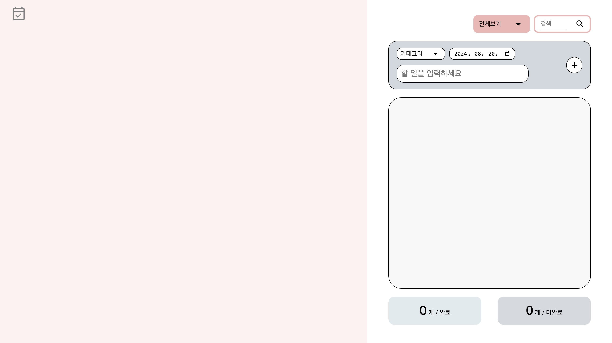
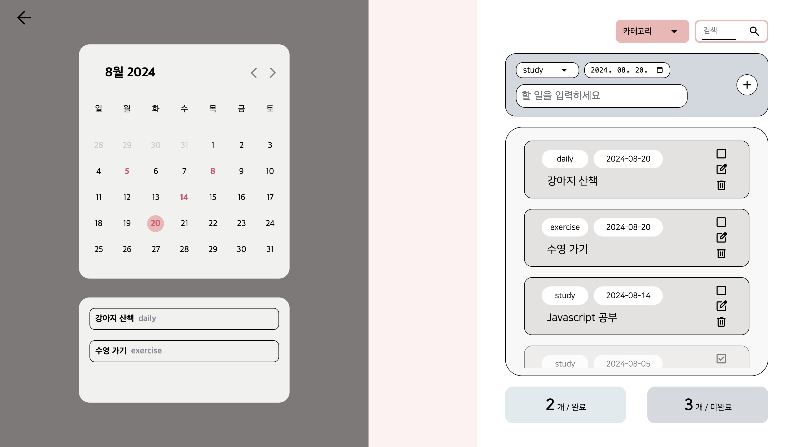

# 🍡 TODO-LIST

프로그래머스 프론트엔드 데브코스 1기 1차 개인 프로젝트 (9팀)

개발 기간: 2024.08.15 ~ 2024.08.20

개발 언어: `JavaScript` `HTML` `CSS`

 

## 🍥 프로젝트 소개 

할 일을 기록하고 일정을 관리할 수 있는 TODO-LIST

 

 

## 📁 주요 기능

### 🔍 투두리스트 추가 기능

- 카테고리를 선택하여 할 일을 카테고리별로 분류할 수 있다.
- 기본적인 카테고리가 제공되며, 사용자가 직접 추가할 수 있다.
- 날짜를 선택하여 일별로 기록하고 캘린더에서 관리할 수 있다.

### 🔍 투두리스트 완료 / 수정 / 삭제 기능

- 체크박스 클릭 시 완료 표시가 되며, 리스트의 가장 마지막으로 이동된다.
- 추후 투두리스트 추가 시, 리스트에서 완료 항목의 위로 배치된다.
- 수정 아이콘 클릭 시 작성한 할 일을 수정할 수 있으며, 완료된 항목은 수정할 수 없다.
- 삭제 아이콘 클릭 시 리스트에서 항목이 삭제된다.

### 🔍 완료 / 미완료 개수 기능

- 완료된 할 일과, 미완료된 할 일의 항목 개수를 한눈에 파악할 수 있다.

### 🔍 카테고리 정렬 및 검색 기능

- 선택한 카테고리에 해당되는 할 일이 리스트에 나타난다.
- 내용을 검색하면 해당 내용이 포함된 할 일이 리스트에 나타난다.

### 🔍 캘린더 기능

- 할 일이 있는 날을 한눈에 파악할 수 있다.
- 해당 날짜를 클릭하면, 캘린더 하단 영역에서 할 일을 간단하게 볼 수 있다.